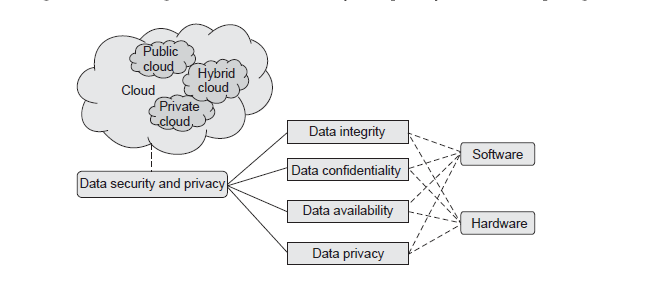

# Cloud Security Services:

## 1. Confidentiality :
-   Confidentiality refers to limiting information access. Sensitive information should be kept secret from individuals who are not authorized to see the information. 

-  In cloud environments, confidentiality primarily pertains to restricting access to data in transit and storage.

-   Data confidentiality is important for users to store their private or confidential data in the cloud. 

-  Authentication and access control strategies are used to ensure
data confidentiality.

-  The data confidentiality, authentication and access control issues in cloud computing could be addressed by increasing the cloud reliability.

## 2. Integrity :
-   This service protects data from malicious modification. 

-  When having outsource their data to remote cloud servers, cloud users must have a way to check whether or not their data at rest or in transit are intact. Such a security service would be of
the core value to cloud users.

- Integrity can extend to how data is stored, processed and retrieved by cloud services and cloud-based IT resources.

-   Data integrity in the cloud system means preserving information integrity.
-  The data should not be lost or modified by unauthorized users.
• Data integrity in the cloud system means preserving information integrity.
-  The data should not be lost or modified by unauthorized users.

-  Data integrity is the basis to provide cloud computing service such as SaaS, PaaS and IaaS.

## 3. Availability :
-  This service assures that data stored in the cloud are available on each user retrieval request. 
- This service is particularly important for data at rest in cloud servers and related to the fulfillment of service level agreement.

-  Data availability means the following : When accidents such as hard disk damage, IDC fire, and network failures occur, the extent that user's data can be used or recovered and how the users verify their data by techniques rather than depending on the credit guarantee by the cloud service provider alone.

-  The cloud service provider should ensure the data security, particularly data confidentiality and integrity. 

-  The cloud provider should share all such concerns
with the client and build trust relationship in this connection. 

-  The cloud vendor should provide guarantees of data safety and explain jurisdiction of local laws to the clients.
